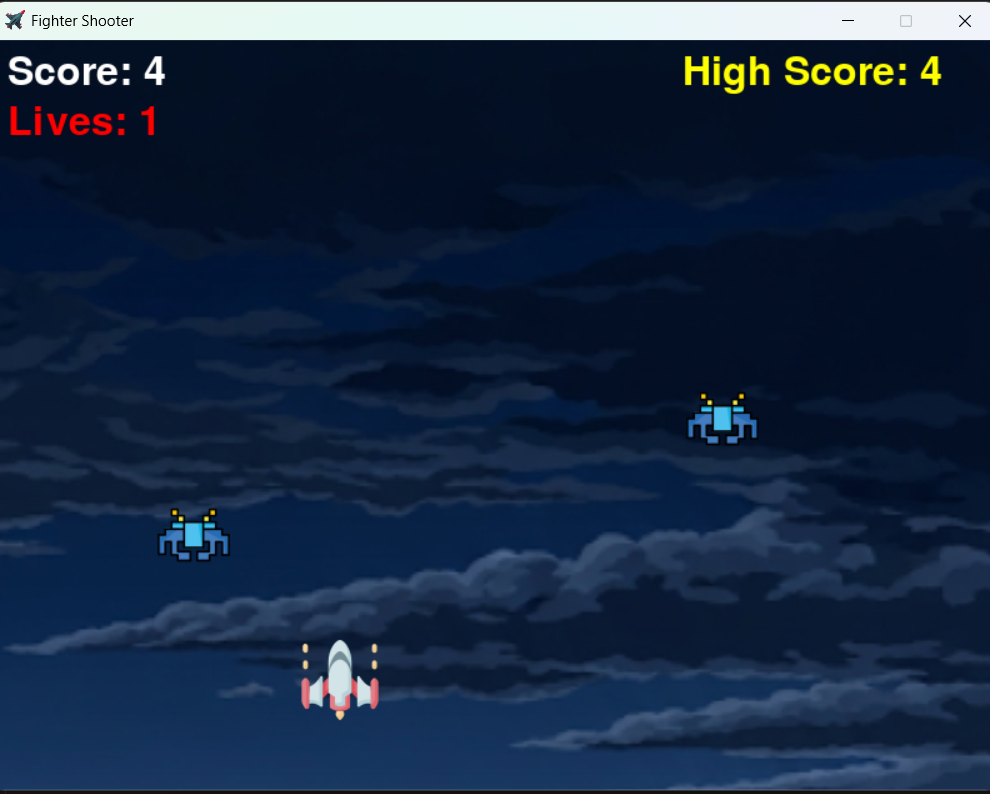
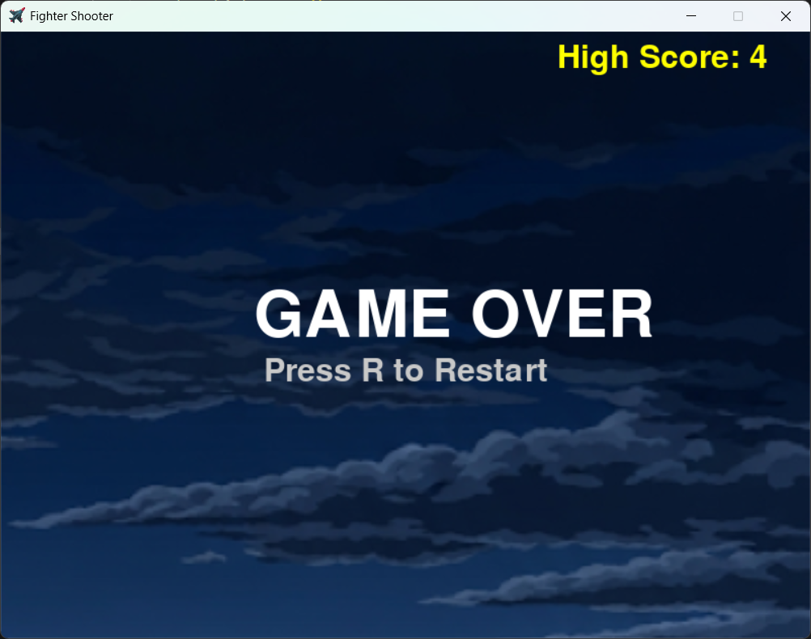

# Fighter Shooter Game

A simple 2D space shooter game built using the Pygame library in Python. The player controls a fighter jet, shoots bullets to destroy enemies, and tries to survive as long as possible. The game keeps track of the player's score, lives, and high score.

## Features

- **Player Control**: Use the arrow keys (left and right) to move the fighter jet, and the space bar to shoot bullets.
- **Enemies**: Enemies fall from the top of the screen and must be destroyed with bullets.
- **Score System**: Each time an enemy is destroyed, the player's score increases.
- **Lives**: The player starts with 3 lives. If an enemy reaches the player's position, a life is lost.
- **High Score**: The game saves the highest score achieved during the current session.
- **Game Over**: When all lives are lost, the game ends and prompts the player to restart by pressing 'R'.

## Installation

### Prerequisites

To run this game, you will need **Python** and **Pygame** installed on your system.

1. **Install Python**:
    - Download and install Python from [python.org](https://www.python.org/).

2. **Install Pygame**:
    - Install the Pygame library using pip:
    
    ```bash
    pip install pygame
    ```

### Running the Game

1. Clone or download this repository to your local machine.
2. Navigate to the folder where the code is stored.
3. Run the following command to start the game:

    ```bash
    python fighter_shooter.py
    ```

## Game Controls

- **Arrow keys (Left/Right)**: Move the fighter jet.
- **Space bar**: Fire bullets.
- **R**: Restart the game after a game over.

## Screenshots

*Here, you can insert images of your game. For example:*




## Game Mechanics

- The player controls a fighter jet at the bottom of the screen.
- Enemies appear at the top and descend towards the player.
- The player can shoot bullets by pressing the space bar to destroy the enemies.
- If an enemy reaches the bottom of the screen or collides with the player, the player loses a life.
- The game ends when the player runs out of lives.
- The score and high score are displayed at the top of the screen.

## File Structure
```
/fighter_shooter/
│
├── images/ # Folder to store all images
│ ├── screenshot1.png # Example: First screenshot for the README
│ ├── screenshot2.png # Example: Second screenshot for the README
│ ├── background.png # Background image for the game
│ ├── fight.png # Icon image for the window
│ ├── arcade-game.png # Fighter jet image
│ ├── art.png # Enemy image
│ └── bullet.png # Bullet image
│
├── fighter_shooter.py # Main game script
├── README.md # This file (README)
```
